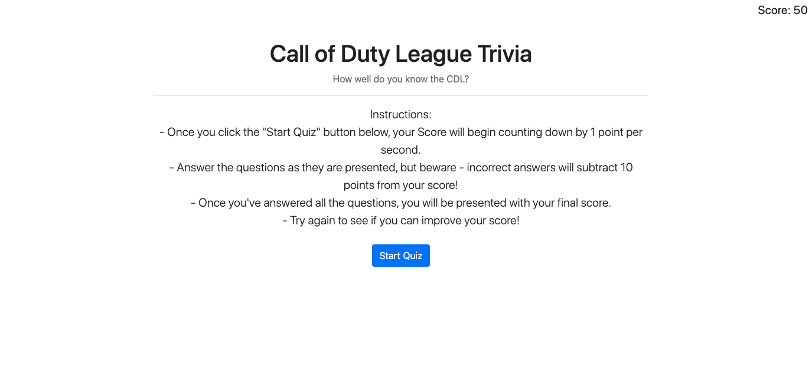

# JavaScriptQuiz-HW

Description:

A timed, 5-question quiz on a topic I am very passionate about: eSports, and more specifically, the Call of Duty League.

Click "Start Quiz", and try to answer the questions as quickly as possible. Keep in mind, however, that incorrect answers will subtract 10 seconds from the clock, so accuracy is important! The remaining time on the clock when all questions have been answered is your final score. 

Link: https://cseibert2667.github.io/JavaScriptQuiz-HW/

Preview:

;

**Please Note**: There are some lines of code that refer to "highscores", however this part is not *yet* functional. I left them there as I do intend to go back and complete this functionality at a later date.